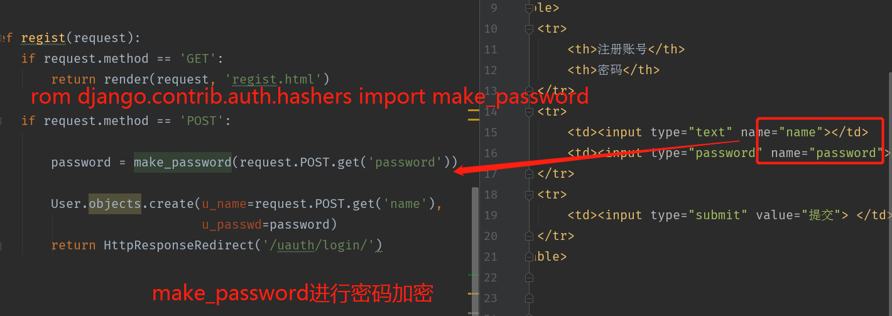
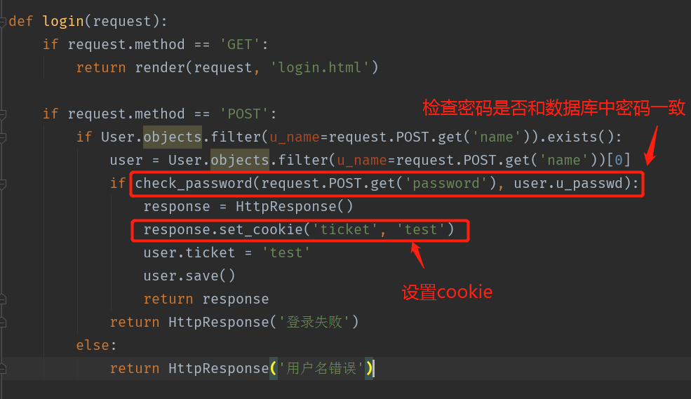
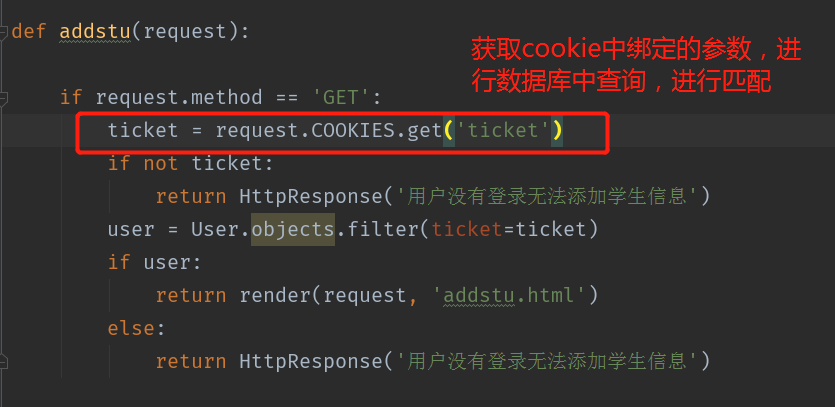
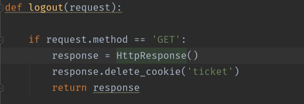

# 登录/注册/登录状态权限验证指南

>Auth: 王海飞
>Data：2018-04-27
>Email：779598160@qq.com
>github：https://github.com/coco369/knowledge

### 前言
通过cookie和token去实现登录功能，用户在登录账号以后，随机产生一个随机数并存在cookie中，并在服务端也存储同一个数在数据库中。
当下一次url请求过来的时候，解析request中绑定的cookie信息，解锁出之前存的随机数，判断该随机数是否是存储在服务器端的数据，如果
没有查询到则表示该cookie过期，或者该cookie是伪造的，或者服务器上存储该信息的数据缓存到期被清空了。则该提示用户重新登录，并且
重新产生随机数，并存储在cookie中以及服务端，以保证下次请求和响应能够顺利。

### 习题
题目：
1) 编写一个方法，用于注册用户的账号和密码。

2) 编写一个方法，用于登录用户的账号和密码，并且登录的时候绑定一个加密的参数在cookie上，并且该加密参数也存储在服务端中。

3）在以后的任意一个请求，我们都获取request中的cookies，查看cookie中绑定的参数是否合法，以及查询是否在服务端存储了。

4）如果验证成功则返回请求url的结果信息到页面，如果验证失败则返回错误提醒信息页面

5) 注销登录

#### 1. 注册方法
从页面中获取账号和密码，进行创建



#### 2. 登录，并且绑定参数到cookie上
先检验用户名是否在数据库中，如果查询到则继续验证密码, 如果密码验证对，则绑定一个参数到cookie中。
解析密码，加密密码来源与一下的模块:
```
from django.contrib.auth.hashers import check_password, make_password
```



#### 3. 在方法中验证cookie中传递的参数是否正确

cookie是在用户提交url请求的时候都会带上的一个参数，所以可以从中获取到我们设置的参数，并且在服务端进行验证，看服务端有这个标识符没有，
如果能查询到，则表示用户登录过了，并且还在登录时效内，则直接返回用户提交url对应的响应。如果在服务端没有查询到数据，则表示标识符过期，
或者无效了，需要登录了，则直接提示错误信息即可!



#### 4. 注销登录

删除cookie中的认证令牌
<br>


