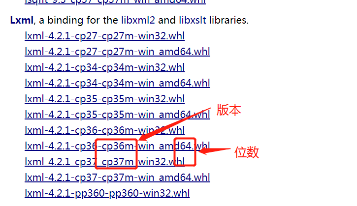
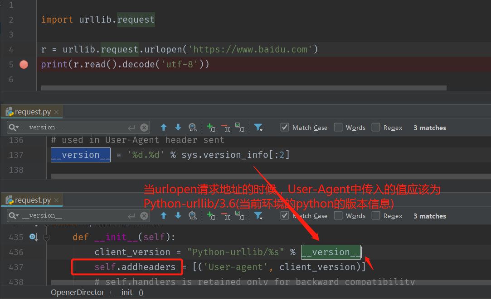

# 爬虫学习使用指南

>Auth: 王海飞
>
>Data：2018-06-04
>
>Email：779598160@qq.com
>
>github：https://github.com/coco369/knowledge 

### 前言

网络爬虫（Web Spider。又被称为网页蜘蛛。网络机器人，又称为网页追逐者），是一种依照一定的规则，自己主动的抓取万维网信息的程序或者脚本。另外一些不常使用的名字还有蚂蚁，自己主动索引。模拟程序或者蠕虫。假设把互联网比喻成一个蜘蛛网，那么Spider就是在网上爬来爬去的蜘蛛。

网络蜘蛛是通过网页的链接地址来寻找网页的。从站点某一个页面（一般是首页）開始，读取网页的内容。找到在网页中的其他链接地址。然后通过这些链接地址寻找下一个网页。这样一直循环下去，直到把这个站点全部的网页都抓取完为止。假设把整个互联网当成一个站点。那么网络蜘蛛就能够用这个原理把互联网上全部的网页都抓取下来。这样看来，网络爬虫就是一个爬行程序，一个抓取网页的程序。

<b>简单地说，网络爬虫的基本任务就是抓取网页内容。</b>

### 1. 数据分析和采集

本爬虫教程中使用的python版本统一为python3.X的版本

#### 1.1 数据分析

爬取网页信息可以使用很多的技术：

1. 获取网页信息：urllib、urllib3、requests

		requests为第三方的库，需要安装才能使用

		pip install requests

2. 解析网页信息：beautifulsoup4(bs4)、re、xpath、lxml

		bs4为第三方的库，需要安装才能使用

		pip install beautifulsoup4

		使用的时候 from bs4 import BeautifulSoup 这样导入

	Python 标准库中自带了 xml 模块，但是性能不够好，而且缺乏一些人性化的 API，相比之下，第三方库 lxml 是用 Cython 实现的，而且增加了很多实用的功能。

		安装lxml，在新版本中无法使用from lxml import etree
		
		pip install lxml 并不推荐这样去安装lxml

		推荐安装的方法：访问网站(https://www.lfd.uci.edu/~gohlke/pythonlibs/#lxml)下载lxml的安装whl文件，然后进行安装。

我这儿下载的是lxml-4.2.1-cp36-cp36m-win_amd64.whl，安装命令如下

		pip install lxml-4.2.1-cp36-cp36m-win_amd64.whl
	
截图：

3. 动态数据解析

	通用：selenium(自动化测试框架)

#### 1.2 数据采集

4. 存储：mysql、redis、mongodb、sqlalchemy

5. 序列化：json

6. 调度器：进程、线程、协程

### 2. 请求头分析

	# 浏览器告诉服务器可以接收的文本类型, */*表示任何类型都可以接收
	Accept: text/html, */*;q=0.8
 
	# 浏览器告诉服务器，数据可以压缩，页面可以解压数据然后进行渲染。做爬虫的时候，最好不要写该参数
	Accept-Encoding: gzip, deflate 
	
	# 语言类型
	Accept-Language: zh-CN,zh;q=0.9 
	
	Cache-Control: max-age=0
	
	# 保持连接
	Connection: keep-alive 
	
	# 会话 
	Cookie: Hm_lvt_3bfcc098e0da26d58c321ba579b04b2f=1527581188,1528137133
	
	# 域名
	Host: www.cdtopspeed.com 
	
	Upgrade-Insecure-Requests: 1

	# 用户代理, 使得服务器能够识别请求是通过浏览器请求过来的，其中包含浏览器的名称/版本等信息
	User-Agent: Mozilla/5.0 (Windows NT 6.1; WOW64) AppleWebKit/537.36 (KHTML, like Gecko) Chrome/65.0.3325.181 Safari/537.36

其中在爬虫中最重要的就是User-Agent：在下面urllib的使用中就会详细的解释User-Agent的使用

### 3. urllib的使用

使用urllib来获取百度首页的源码
	 
	import urllib.request
	
	r = urllib.request.urlopen('https://www.baidu.com')
	print(r.read().decode('utf-8'))

按照我们的想法来说，输出的结果应该是百度首页的源码才对，但是输出却不对(多请求几次，就会出现如下的结果)，如下结果：

	<html>
	<head>
		
	</head>
	<body>
		<noscript><meta http-equiv="refresh" content="0;url=http://www.baidu.com/"></noscript>
	</body>
	</html>

以上的结果并不是我们想要的，我们可以来查看一下为什么会出现这种问题的原因。我们可以想到刚才说的，请求头中的最重要的参数User-Agent参数，该参数是用来告诉服务器，请求的url是来源于哪儿的，是来源于浏览器还是来源于其他地方的。如果是来源于非浏览器的会就不会返回源码信息给你的，直接拦截掉你的请求

分析以上代码中，默认提交的请求头中的User-Agent到底传递了什么值：

接下来，就是优化以上的代码，实现目的就是告诉服务器我们这个请求是来源于浏览器的。
	
	header = {'User-Agent': 'Mozilla/5.0 (Windows NT 6.1; WOW64) AppleWebKit/537.36 (KHTML, like Gecko)Chrome/65.0.3325.181 Safari/537.36'}
	
	res = urllib.request.Request('https://www.baidu.com', headers=header)
	
	# 读取url的页面源码
	r = urllib.request.urlopen(res)
	# decode解码，encode编码
	print(r.read().decode('utf-8'))

按照这样去解析，就可以获取到百度的首页源代码了，展示部门代码如下：

	<html>
	<head>
    
    <meta http-equiv="content-type" content="text/html;charset=utf-8">
    <meta http-equiv="X-UA-Compatible" content="IE=Edge">
	<meta content="always" name="referrer">
    <meta name="theme-color" content="#2932e1">
    <link rel="shortcut icon" href="/favicon.ico" type="image/x-icon" />
    <link rel="search" type="application/opensearchdescription+xml" href="/content-search.xml" title="百度搜索" />
    <link rel="icon" sizes="any" mask href="//www.baidu.com/img/baidu_85beaf5496f291521eb75ba38eacbd87.svg">
	
	
	<link rel="dns-prefetch" href="//s1.bdstatic.com"/>
	<link rel="dns-prefetch" href="//t1.baidu.com"/>
	<link rel="dns-prefetch" href="//t2.baidu.com"/>
	<link rel="dns-prefetch" href="//t3.baidu.com"/>
	<link rel="dns-prefetch" href="//t10.baidu.com"/>
	<link rel="dns-prefetch" href="//t11.baidu.com"/>
	<link rel="dns-prefetch" href="//t12.baidu.com"/>
	<link rel="dns-prefetch" href="//b1.bdstatic.com"/>
    
    <title>百度一下，你就知道</title>
    

	<style id="css_index" index="index" type="text/css">html,body{height:100%}
	html{overflow-y:auto}
	body{font:12px arial;text-align:;background:#fff}
	body,p,form,ul,li{margin:0;padding:0;list-style:none}
	body,form,#fm{position:relative}
	td{text-align:left}
	img{border:0}
	a{color:#00c}
	a:active{color:#f60}
	input{border:0;padding:0}
	#wrapper{position:relative;_position:;min-height:100%}
	#head{padding-bottom:100px;text-align:center;*z-index:1}

	...忽略....
	...忽略....
	...忽略....

	</body>
	</html>

