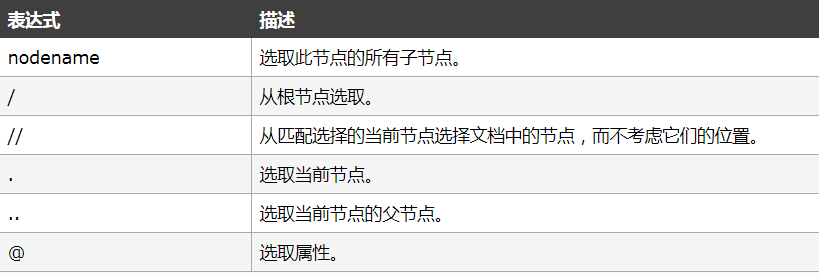

# 爬虫学习使用指南

>Auth: 王海飞
>
>Data：2018-06-19
>
>Email：779598160@qq.com
>
>github：https://github.com/coco369/knowledge>

### 1. XPATH 术语

[中文文档地址](http://www.w3school.com.cn/xpath)

在 XPath 中，有七种类型的节点：元素、属性、文本、命名空间、处理指令、注释以及文档（根）节点。XML 文档是被作为节点树来对待的。树的根被称为文档节点或者根节点。

请看下面这个 XML 文档：
	
	<?xml version="1.0" encoding="ISO-8859-1"?>
	
	<bookstore>
	
	<book>
	  <title lang="en">Harry Potter</title>
	  <author>J K. Rowling</author> 
	  <year>2005</year>
	  <price>29.99</price>
	</book>
	
	</bookstore>

上面的XML文档中的节点例子：

	<bookstore> （文档节点）
	<author>J K. Rowling</author> （元素节点）
	lang="en" （属性节点） 
	基本值（或称原子值，Atomic value）
	基本值是无父或无子的节点。

#### 1.1 节点关系

父（Parent）、子（Children）
每个元素以及属性都有一个父。

例子:

	<bookstore>
		<book>
		  <title>Harry Potter</title>
		  <author>J K. Rowling</author>
		  <year>2005</year>
		  <price>29.99</price>
		</book>
	</bookstore>

book 元素是 title、author、year 以及 price 元素的父

title、author、year 以及 price 元素都是 book 元素的子

title、author、year 以及 price 元素都是同胞：

title 元素的先辈是 book 元素和 bookstore 元素

bookstore 的后代是 book、title、author、year 以及 price 元素

#### 1.2 选取节点

XPath 使用路径表达式在 XML 文档中选取节点。节点是通过沿着路径或者 step 来选取的。

简单的案例：

使用lxml来解析我们的网页结构，自定义一个简单的html结构，其中包含div和ul和li标签

	from lxml import etree	

	html = '''
		<!DOCTYPE html>
		<html lang="en">
		<head>
		    <meta charset="UTF-8">
		    <title>Title</title>
		</head>
		<body>
		    

		        <ul>
		            <li class="class1"><a href="class1.html">1</a></li>
		            <li class="class2"><a href="class2.html">2</a></li>
		            <li class="class3"><a href="class3.html">3</a></li>
		            <li class="class4"><a href="class4.html">4</a></li>
		            <li class="class5"><a href="class5.html">5</a></li>
		            <li>
		                <ul>
		                    <li class="class1"><a href="class6.html">6</a></li>
		                    <li class="class7"><a href="class7.html">7</a></li>
		                    <li class="class8"><a href="class8.html">8</a></li>
		                </ul>
		            </li>
		        </ul>
		    

		</body>
		</html>
	'''
	
	# 解析html结构
	html = etree.HTML(html)
	
	# 获取根节点
	a = html.xpath('/html')
	print(a)
	
	# 获取当前节点
	a1 = html.xpath('//ul')
	print(a1)
	
	# 获取当前节点
	for i in a1:
	    print(i.xpath('.'))
	
	# 获取当前第一个节点的父节点
	a2 = a1[0]
	a3 = a2.xpath('..')
	print(a3)
	
	# 选择属性,获取ul下的li的类定义为class1的信息
	a4 = html.xpath('//ul/li[@class="class1"]')
	print(a4)
	
	# 获取全局的div下的全局的ul
	a5 = html.xpath('//div//ul')
	print(a5)
	
	# 获取任意节点下的class为class1的元素
	a6 = html.xpath('//*[@class="class1"]')
	print(a6)
	
	# 获取ul节点下的第一个元素
	a7 = html.xpath('//ul/li[1]')
	print(a7)
	
	# 获取div下第一个ul元素
	a8 = html.xpath('//div/ul[1]')
	print(a8)
	
	# 获取ul标签下的li标签中a的值
	a9 = html.xpath('//ul/li/a')
	for li in a9:
	    print(li.xpath('./text()'))
	
	# 获取li标签下a的href属性
	for li in a9:
	    print(li.xpath('./@href'))

运行结果：

	[<Element html at 0x2cd4a48>]
	[<Element ul at 0x2cd4988>, <Element ul at 0x2cd49c8>]
	[<Element ul at 0x2cd4988>]
	[<Element ul at 0x2cd49c8>]
	[<Element div at 0x2cd4a88>]
	[<Element li at 0x2cd4ac8>, <Element li at 0x2cd4b48>]
	[<Element ul at 0x2cd4988>, <Element ul at 0x2cd49c8>]
	[<Element li at 0x2cd4ac8>, <Element li at 0x2cd4b48>]
	[<Element li at 0x2cd4ac8>, <Element li at 0x2cd4b48>]
	[<Element ul at 0x2cd4988>]
	['1']
	['2']
	['3']
	['4']
	['5']
	['6']
	['7']
	['8']
	['class1.html']
	['class2.html']
	['class3.html']
	['class4.html']
	['class5.html']
	['class6.html']
	['class7.html']
	['class8.html']
	
	Process finished with exit code 0

#### 1.2 智联岗位爬取，岗位名称，岗位的公司信息(zhilian_spider04.py)

该案例比只爬取岗位个数更进一步，需要使用xpath来解析整个页面，获取想要的数据。

	import urllib.request
	from urllib import parse
	from lxml import etree
	
	
	def zhaopin_msg(url):
	    """
	     获取智联上招聘信息
	     1. 获取职位的个数
	        
	            共<em>1473</em>个职位满足条件
	        
	    """
	    header = {
	        'User-Agent': 'Mozilla/5.0 (Windows NT 6.1; WOW64) AppleWebKit/537.36 (KHTML, like Gecko) Chrome/65.0.3325.181 Safari/537.36'
	    }
	    req = urllib.request.Request(url=url, headers=header)
	    res = urllib.request.urlopen(req)
	
	    # 查询岗位名称和公司名称
	    tree = etree.HTML(res.read())
	    content1 = tree.xpath('//tr/td/div/a[1]/text()')
	    content2 = tree.xpath('//tr/td/a[1]/text()')
	    return content1, content2
	
	
	if __name__ == '__main__':
	
	    # 获取从客户端接收到的参数
	    job_name = input('请输入岗位名称:')
	    city_name = input('请输入城市名称:')
	
	    # 将输入参数进行编码，输入参数，python和成都，输出结果为:jl=%E6%88%90%E9%83%BD&kw=python
	    search_params = parse.urlencode({'jl': city_name, 'kw': job_name})
	    # urllib进行解析的网站的url
	    url = 'https://sou.zhaopin.com/jobs/searchresult.ashx?%s' % search_params
	    # 进行解析地址
	    result = zhaopin_msg(url)
	    print(result)

### 2. re正则匹配

匹配规则：（原始字符串'booby123'）
	
	^ 开头    '^b.*'----以b开头的任意字符
	
	$ 结尾    '^b.*3$'----以b开头，3结尾的任意字符
	
	* 任意长度（次数），≥0       
	
	? 非贪婪模式，非贪婪模式尽可能少的匹配所搜索的字符串 '.*?(b.*?b).*'----从左至右第一个b和的二个b之间的内容（包含b）
	
	+ 一次或多次
	
	{2} 指定出现次数2次
	
	{2,} 出现次数≥2次
	
	{2,5} 出现次数2≤x≤5
	
	| 或     例如，“z|food”能匹配“z”或“food”(此处请谨慎)。“[z|f]ood”则匹配“zood”或“food”或"zood"。
	
	
	[] 中括号中任意一个符合即可（中括号里面没有分转义字符）   '[abc]ooby123'----只要开头符合[]中任意一个即可
	
	[^] 只要不出现[]的即可
	
	[a-Z] 从小a到大Z        '1[48357][0-9]{9}'----电话号码
	
	. 任意字符

	
	\s 匹配不可见字符 \n \t    '你\s好'----可以匹配‘你 好’
	
	\S 匹配可见字符，即普通字符
	
	\w 匹配下划线在内的任何单词字符
	
	\W 和上一个相反
	
	
	[\u4E00-\u9FA5] 只能匹配汉字
	
	() 要取出的信息就用括号括起来
	
	\d 数字
