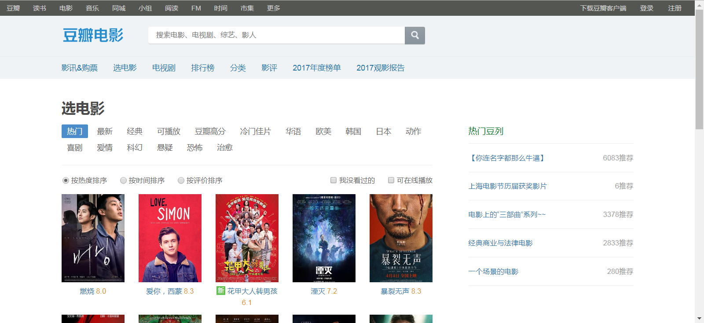

# 爬虫学习使用指南--动态分析

>Auth: 王海飞
>
>Data：2018-06-20
>
>Email：779598160@qq.com
>
>github：https://github.com/coco369/knowledge 

### 前言

根据权威机构发布的全球互联网可访问性审计报告，全球约有四分之三的网站其内容或部分内容是通过JavaScript动态生成的，这就意味着在浏览器窗口中“查看网页源代码”时无法在HTML代码中找到这些内容，也就是说我们之前用的抓取数据的方式无法正常运转了。解决这样的问题基本上有两种方案：

>一是JavaScript逆向工程；

>另一种是渲染JavaScript获得渲染后的内容。
>

### 1. JavaScript逆向工程

我们以[豆瓣电影](https://movie.douban.com/explore#!type=movie&tag=%E7%83%AD%E9%97%A8&sort=recommend&page_limit=20&page_start=0)为例，说明什么是JavaScript逆向工程。其实所谓的JavaScript逆向工程就是找到通过Ajax请求动态获取数据的接口。

但是当我们在浏览器中通过右键菜单“显示网页源代码”的时候，居然惊奇的发现页面的HTML代码中连一个电影的名称都搜索不到。

那网页中的数据到底是怎么加载出来的呢，其实网页中的数据就是一个动态加载出来的。可以在浏览器的“开发人员工具”的“网络”中可以找到获取这些图片数据的网络API接口，如下图所示。

那么结论就很简单了，只要我们找到了这些网络API接口，那么就能通过这些接口获取到数据，当然实际开发的时候可能还要对这些接口的参数以及接口返回的数据进行分析，了解每个参数的意义以及返回的JSON数据的格式，这样才能在我们的爬虫中使用这些数据。

### 2. selenium自动框架

使用自动化测试工具Selenium，它提供了浏览器自动化的API接口，这样就可以通过操控浏览器来获取动态内容。首先可以使用pip来安装Selenium。
 
#### 2.1 安装

	pip install selenium

#### 2.2 使用

	