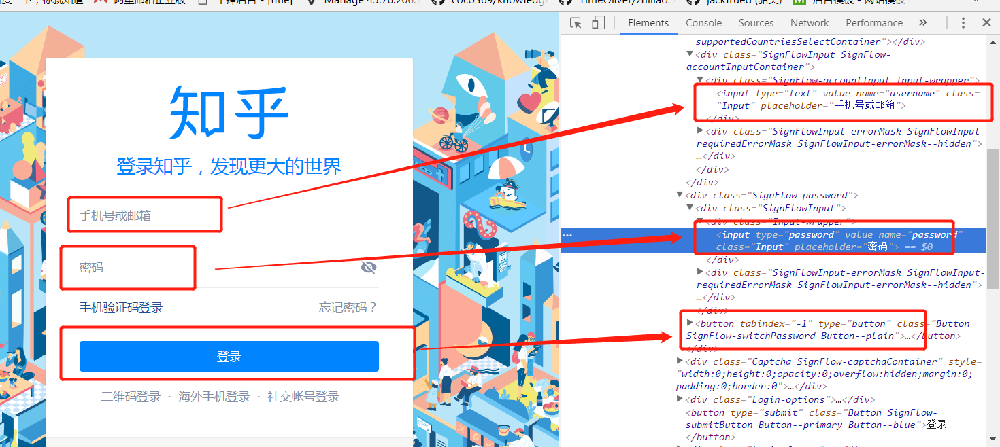

# 爬虫学习使用指南

>Auth: 王海飞
>
>Data：2018-06-20
>
>Email：779598160@qq.com
>
>github：https://github.com/coco369/knowledge 

### 1. 使用selenium，模拟登陆知乎

使用selenium去模拟浏览器的行为去登陆知乎，需要清楚登陆页面中的输入用户名和密码，还有登陆按钮的样式，这样selenium才能通过样式id或者class去获取到该按钮，进行相关的填入用户信息和提交的操作

	from selenium import webdriver
	import time

	# 创建浏览器对象
	chromedriver = 'C:\Program Files (x86)\Google\Chrome\Application\chromedriver'
	browser=webdriver.Chrome(chromedriver)

	# 请求加载登录链接
	browser.get('https://www.zhihu.com/signin')
	time.sleep(3)

	# 输入账号
	browser.find_element_by_css_selector("input[name='username']").send_keys('17078075655')

	# 输入密码
	browser.find_element_by_css_selector("input[name='password']").send_keys('19910825580lb')

	# 模拟点击登录
	browser.find_element_by_css_selector(".SignFlow-submitButton").click()
	time.sleep(3)

	# 截图
	browser.save_screenshot("zhihu.png")
	browser.quit()

### 2. 使用selenium去爬取豆瓣电影的信息
	

	from bs4 import BeautifulSoup
	from selenium import webdriver
	
	
	def main():
	    chromedriver = 'C:\Program Files (x86)\Google\Chrome\Application\chromedriver'
	    driver = webdriver.Chrome(chromedriver)
	    driver.get('https://movie.douban.com/explore#!type=movie&tag=%E7%83%AD%E9%97%A8&sort=recommend&page_limit=20&page_start=0')
	    
		soup = BeautifulSoup(driver.page_source, 'lxml')
	    for img_tag in soup.body.select('img[src]'):
	        print(img_tag.attrs.get('src'))
	        print(img_tag.attrs.get('alt'))
	
	
	if __name__ == '__main__':
	    main()