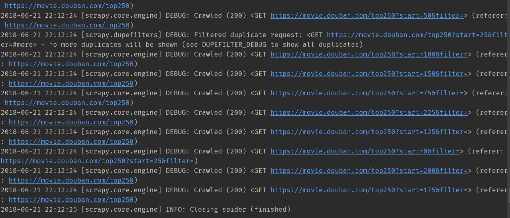

# 爬虫学习使用指南--scrapy框架

>Auth: 王海飞
>
>Data：2018-06-21
>
>Email：779598160@qq.com
>
>github：https://github.com/coco369/knowledge 

### 爬取豆瓣电影前250的电影资源，地址(https://movie.douban.com/top250)

按照scrapy的处理流程可以整理如下操作：

#### 1. <b>items.py</b>:设置数据存储模板，用于结构化数据

在items.py文件中定义字段，这些字段用来保存数据，方便后续的操作。

	import scrapy
	

	class DoubanItem(scrapy.Item):
	
	    name = scrapy.Field()
	    year = scrapy.Field()
	    score = scrapy.Field()
	    director = scrapy.Field()
	    classification = scrapy.Field()
	    actor = scrapy.Field()

#### 2. <b>spiders</b>:爬虫目录，如：创建文件，编写爬虫规则。
	
	
	from scrapy.selector import Selector
	from scrapy.linkextractors import LinkExtractor
	from scrapy.spiders import CrawlSpider, Rule
	
	from dbspider.items import DoubanItem
	
	
	class MovieSpider(CrawlSpider):
	    name = 'douban'
	    allowed_domains = ['movie.douban.com']
	    start_urls = ['https://movie.douban.com/top250']
	    rules = (
	        Rule(LinkExtractor(allow=(r'https://movie.douban.com/top250\?start=\d+.*'))),
	    )
	
	    def parse_item(self, response):
	        sel = Selector(response)
	        item = DoubanItem()
	        item['name']=sel.xpath('//*[@id="content"]/h1/span[1]/text()').extract()
	        item['year']=sel.xpath('//*[@id="content"]/h1/span[2]/text()').re(r'\((\d+)\)')
	        item['score']=sel.xpath('//*[@id="interest_sectl"]/div/p[1]/strong/text()').extract()
	        item['director']=sel.xpath('//*[@id="info"]/span[1]/a/text()').extract()
	        item['classification']= sel.xpath('//span[@property="v:genre"]/text()').extract()
	        item['actor']= sel.xpath('//*[@id="info"]/span[3]/a[1]/text()').extract()
	        return item

完成前面两步骤的时候，我们就可以来运行我们的项目了。运行命令 scrapy crawl douban。其中我们可以在控制台看到爬取到的数据，如果想将这些数据保存到文件中，可以通过-o参数来指定文件名，Scrapy支持我们将爬取到的数据导出成JSON、CSV、XML、pickle、marshal等格式。

	scrapy crawl douban -o result.json

运行结果，可能出乎我们的意料，我们发现了在请求电影https://movie.douban.com/top250地址的时候，报了一个403的错误。众所周知，403明显是权限禁止访问了。这个时候就需要去设置我们之前设置过的USER_AGENT的参数了

在settings.py中添加如下的USER_AGENT信息：

	USER_AGENT = 'Mozilla/5.0 (Windows NT 6.1; WOW64) AppleWebKit/537.36 (KHTML, like Gecko) Chrome/55.0.2883.87 Safari/537.36'

再次：我们再去运行scrapy crawl douban的命令，即可正常获取信息

从返回的结果中可以看出，我们定义了匹配的rule规则后，电影top250的分页地址信息，也都全部加载出来了，并且GET请求也成功的获取到了对应url的信息。在接下来，我们做数据持久化的时候，相当方便了。

#### 3. <b>pipelines</b>:数据处理行为，如：一般结构化的数据持久化

